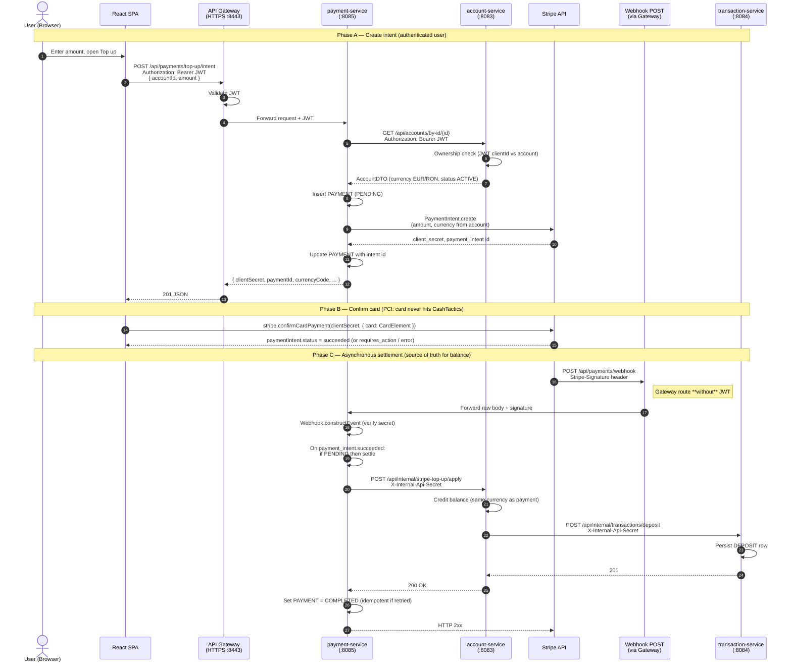

# Card top-up flow — sequence diagram (thesis / CashTactics)

This document describes the **one-time card top-up** integration (Stripe Test mode) as implemented in the codebase: **Browser → API Gateway → payment-service → Stripe**, then **Stripe → Webhook → payment-service → account-service → transaction-service**.

It is suitable to cite or adapt in a bachelor thesis chapter on *Open Banking / external payment gateways* or *microservice orchestration*.

---

## 1. High-level actors

| Actor | Role |
|--------|------|
| **Browser (React)** | Collects amount, renders Stripe **CardElement**, calls `confirmCardPayment` (card data goes to Stripe only). |
| **API Gateway** | TLS termination, JWT on user routes; **webhook route has no JWT** so Stripe CLI / Stripe can POST events. |
| **payment-service** | Creates **PaymentIntent**, persists `PAYMENT` row; webhook applies settlement. |
| **Stripe** | Charges the card, emits `payment_intent.succeeded`. |
| **account-service** | Credits balance (internal HTTP + shared secret). |
| **transaction-service** | Records a **DEPOSIT** ledger line (internal HTTP + shared secret). |

---

## 2. Sequence diagram (Mermaid)

Paste into any Mermaid-capable editor (GitHub, Notion, VS Code Mermaid preview, thesis LaTeX with `mermaid` support).

---

## 3. Thesis-friendly bullet points

1. **Separation of concerns**: User-facing payment orchestration lives in **payment-service**; **ledger and balance** remain in **account-service** and **transaction-service**, matching schema-per-service boundaries.

2. **Security**  
   - **End-user**: JWT at the gateway for `/api/payments/**` except the dedicated **webhook** path.  
   - **Card data**: handled only by **Stripe.js** / Stripe-hosted primitives — not stored or logged by CashTactics.  
   - **Service-to-service**: internal credit/deposit uses a **shared secret header** (`X-Internal-Api-Secret`), not the user JWT (webhook has no user session).

3. **Currency policy**: The client sends **only** `accountId` and `amount`; **currency** is read from the **account** record so the PaymentIntent always matches the internal account denomination (EUR/RON in the current product rule).

4. **Idempotency**: Webhook handling updates a payment from **PENDING** to **COMPLETED** and applies credit **once**; duplicate `payment_intent.succeeded` deliveries skip settlement if already **COMPLETED**.

5. **Alignment with Open Banking / PSD2 narrative**: External **payment initiation** (Stripe as payment service provider in test mode) is integrated without merging card processing into the core ledger service — a common pattern in **modular FinTech** architectures.

---

## 4. Related docs

- Operational setup (CLI, env vars): **[../docs/STRIPE_TOP_UP_SETUP.md](../docs/STRIPE_TOP_UP_SETUP.md)**  
- Gateway and services overview: **[ARCHITECTURE.md](ARCHITECTURE.md)**
